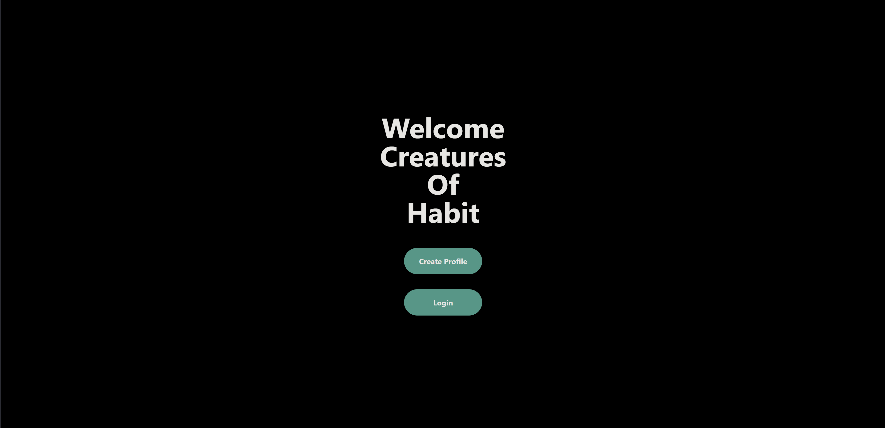

# habit-tool

## Description

[Habit Tool](https://habit-tool.onrender.com) is a product that will allow you to keep track of your progress toward being the best version of yourself that you can be! This project was built because we all have goals we are striving toward and thus, we want to have a place to keep track of our progress toward them. The project is written in a combination of React (front end) and GraphQL (backend)

Provide a short description explaining the what, why, and how of your project. Use the following questions as a guide:

- What was your motivation?
- Why did you build this project? (Note: the answer is not "Because it was a homework assignment.")
- What problem does it solve?
- What did you learn?

## Table of Contents (Optional)

## Installation
1. Clone the repository
2. Run ```npm i```, followed by ```npm run build```. This will compile the project.
3. (Optional) Run ```npm run seed``` to generate some sample users.
4. Run ```npm run start:dev``` to run a local development version.
What are the steps required to install your project? Provide a step-by-step description of how to get the development environment running.

## Usage


If you'd like a same production version, this can be found [here](https://habit-tool.onrender.com) 

There are a couple of options available upon starting the application.
If you didn't create seed users or just prefer to have your own account to work with, creating a profile will be where to start.

After creating a profile, it's time to setup some habits! Adding habits can be done by selecting an optional category or by manually entering the information manually. From there, enter the unit of measurement (e.g. 8 hours, once per day, etc.)


## Credits
|Name       | Link  |
|-----------|-------|
|Pablo Castro |https://github.com/pablocast253|
|Matt Aceves|https://github.com/mmaceves|
|John Brunson|https://github.com/JohnBrunson|


## License
[MIT](https://choosealicense.com/licenses/mit/)

