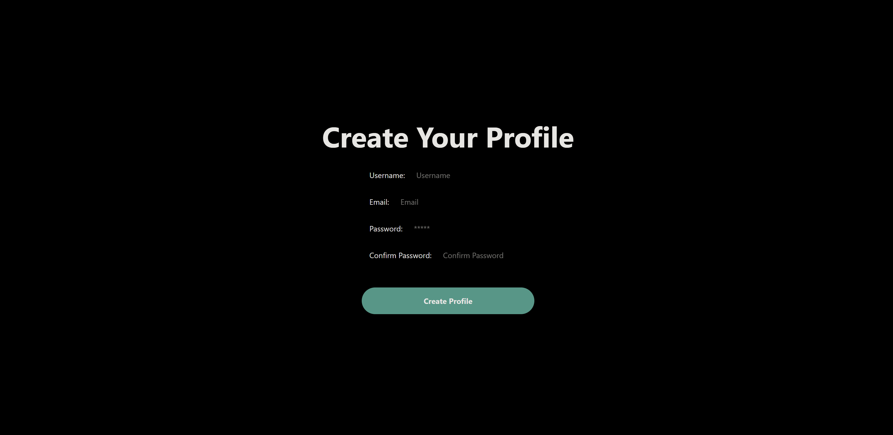
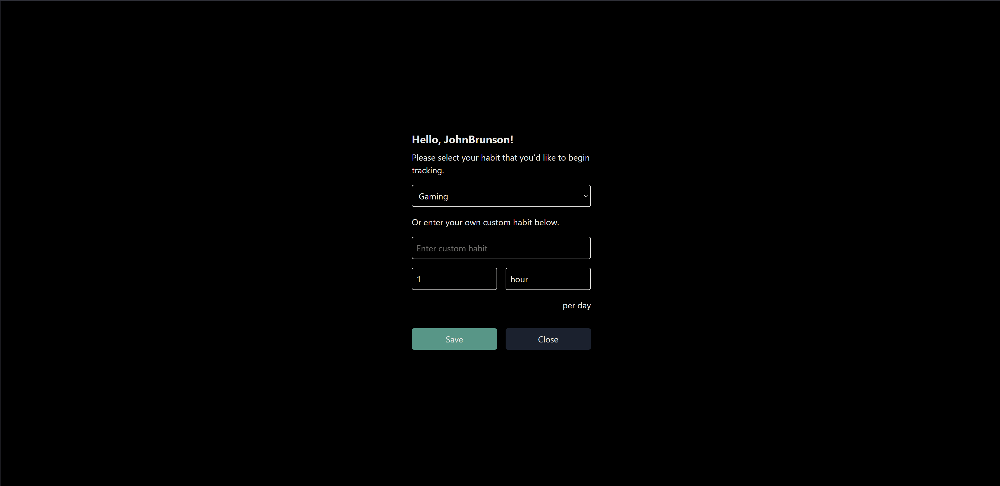
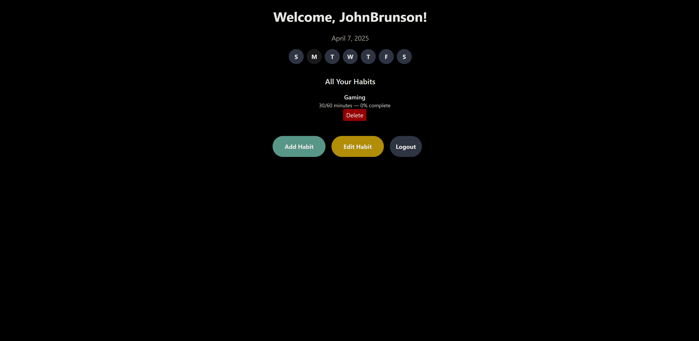

# habit-tool

## Description

[Habit Tool](https://habit-tool.onrender.com) is a product that will allow you to keep track of your progress toward being the best version of yourself that you can be! This project was built because we all have goals we are striving toward and thus, we want to have a place to keep track of our progress toward them. The project is written in a combination of React (front end) and GraphQL (backend) with MongoDB acting as the database. 

## Installation

1. Clone the repository
2. Run `npm i`, followed by `npm run build`. This will compile the project.
3. (Optional) Run `npm run seed` to generate some sample users.
4. Run `npm run start:dev` to run a local development version.
   What are the steps required to install your project? Provide a step-by-step description of how to get the development environment running.

## Usage

If you'd like a same production version, this can be found [here](https://habit-tool.onrender.com)

There are a couple of options available upon starting the application.
If you didn't create seed users or just prefer to have your own account to work with, creating a profile will be where to start.

Simply enter your username, email and password then click "Create profile." The system should alert you to its success.

After creating a profile, it's time to setup some habits! Adding habits can be done by selecting an optional category or by entering the information manually. From there, enter the unit of measurement (e.g. 8 hours, once per day, etc.) and choose save. (Close will close without saving.)

The habit page should now show your new habit. You can then choose to edit the habit or logout. (Or if you don't like your habit, select "Delete" and it will be gone!)

If you choose to edit your habit, all fields will be required. In order to keep things as straight forward as possible, the unit of time will be entered for both target goals and actual performance against those goals. Clicking "Save" will save all changes.

### Known issues

- Progress will always show 0%. (Future development!)

## Credits

| Name         | Link                            |
| ------------ | ------------------------------- |
| Pablo Castro | https://github.com/pablocast253 |
| Matt Aceves  | https://github.com/mmaceves     |
| John Brunson | https://github.com/JohnBrunson  |

## License

[MIT](https://choosealicense.com/licenses/mit/)
